# Practical Lab: Docker Lifecycle & DevSecOps Automation

This documentation outlines the complete transition from manual container management to a fully automated, security-hardened DevSecOps pipeline using GitHub Actions. The full structured documentation and materials based on the reference; readme file :https://github.com/samuel-nartey/devops-labs/blob/feature/docker-manual-lab/docker-manual-automated-lab/README.md 

---

## Phase 0: Pull and Inspect a Public Container

The initial phase focused on interacting with official images to understand container structure and default security postures.

* **Action:** Pulled the official Nginx image from Docker Hub.

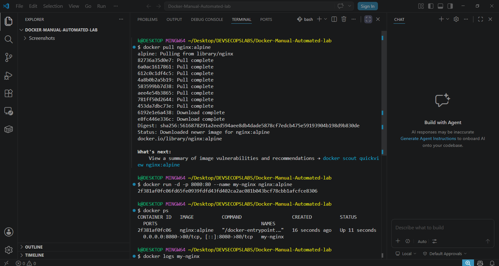
  
* **Verification:** Accessed the Nginx welcome page at `http://localhost:8080`.

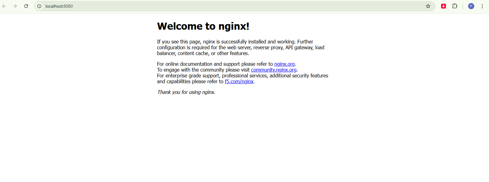

* **Analysis:** Used `docker inspect` to examine container metadata. This highlighted the **"Insecure Default"** scenario where containers often run as the **root** user, which can increase the attack surface of the host kernel.

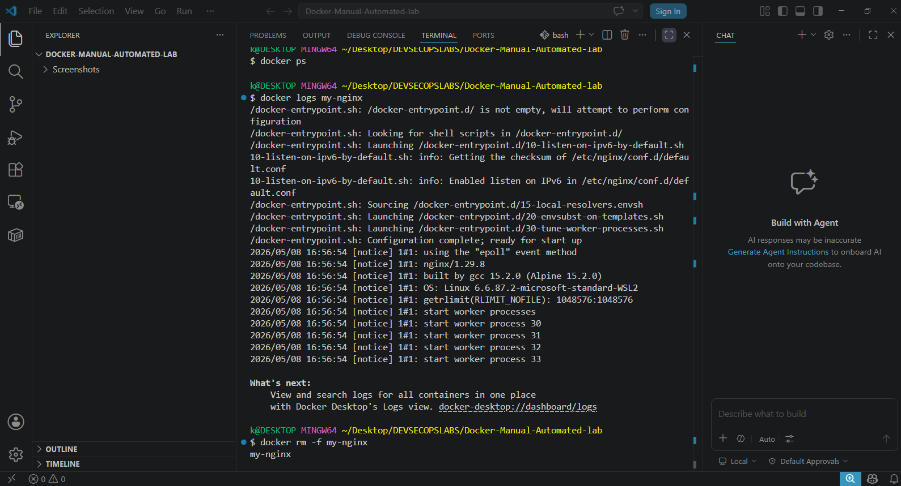

---

## Phase 1: Build, Push, Pull & Share Your Own Image

### 1. Generating a Docker Hub Access Token
To securely push images, a **Personal Access Token (PAT)** was generated on Docker Hub. This is a best practice to ensure authentication without exposing primary account passwords in CLI or CI/CD environments.

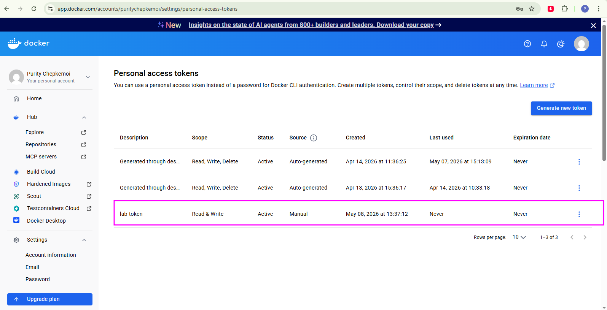

### 2. Create, Build & Test Locally
A custom web application was developed and containerized.

* **Local Build:** Created a Dockerfile, built the image, and tagged it locally.

 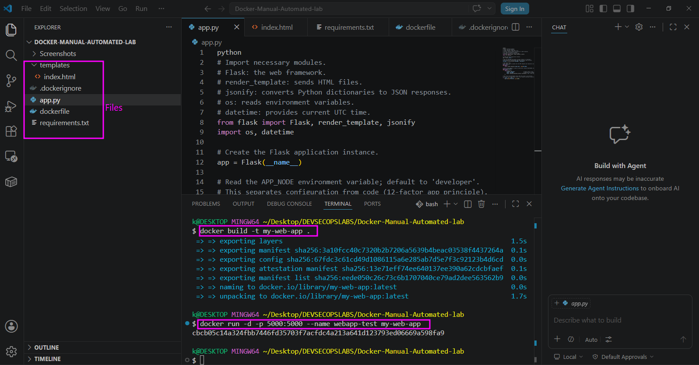

 ###  Errors Encountered & Resolution

 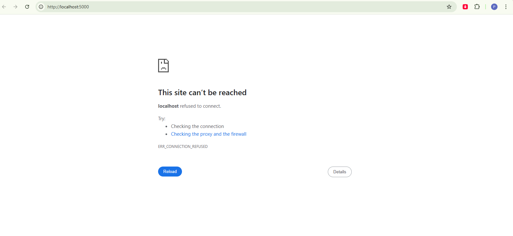

Fixes:
Removed the stray python word on the first line of app.py that was causing a NameError on startup. Added the missing CMD ["python3", "app.py"] instruction at the end of the Dockerfile so the container knows what command to run, since without it Docker was launching python3 with no arguments and immediately exiting cleanly with no output. 
 
* **Testing:** Verified the application and its `/health` endpoint in the browser at `http://localhost:5000`.

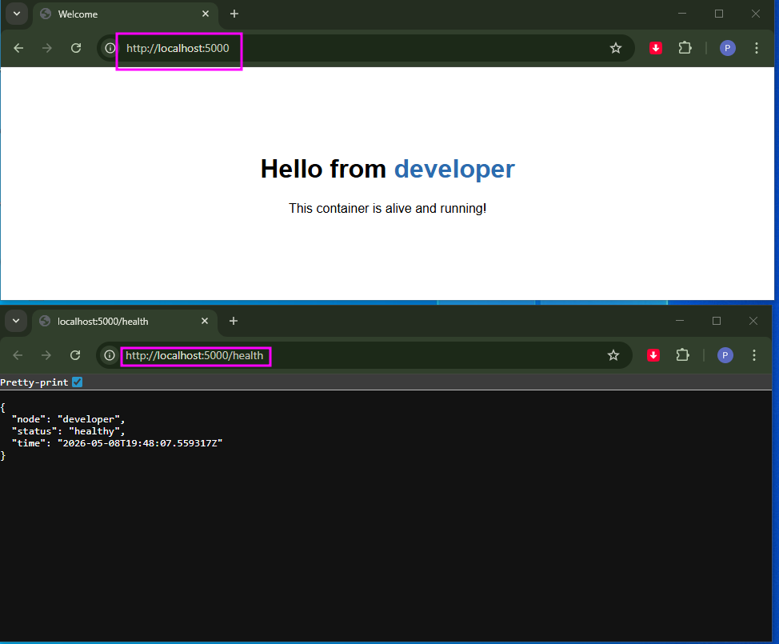

### 3. Push to Docker Hub

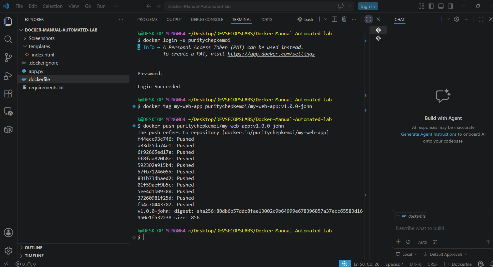

The verified image was pushed to a repository on Docker Hub to facilitate sharing and automated deployments.
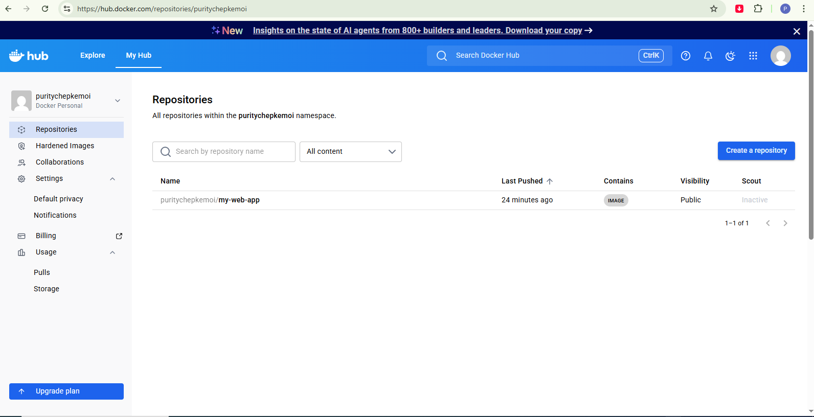

### 4. Pull Your Own Image
Verification was completed by pulling the image back from the registry, simulating how the application would be consumed in a production environment.

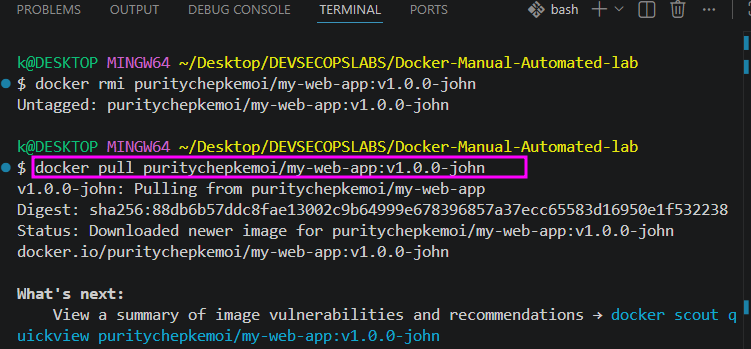

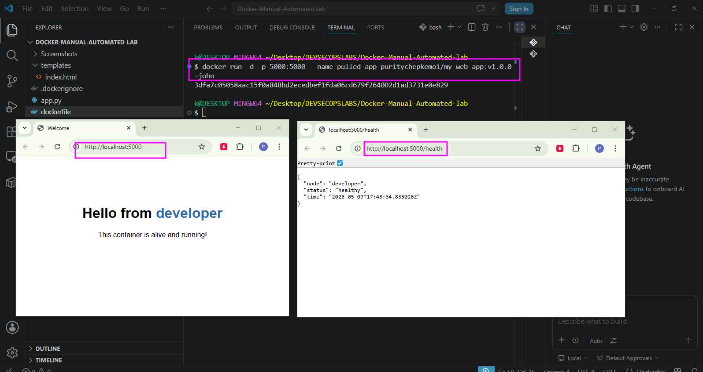

---

## Phase 2: Automate with a DevSecOps Pipeline (GitHub Actions)

### 1. Set Up Your GitHub Repository
The project was initialized in a GitHub repository to serve as the source of truth for the automation pipeline.

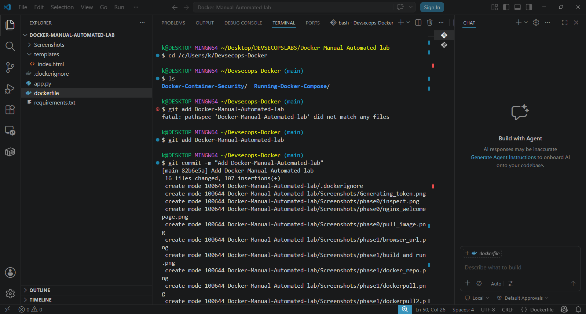
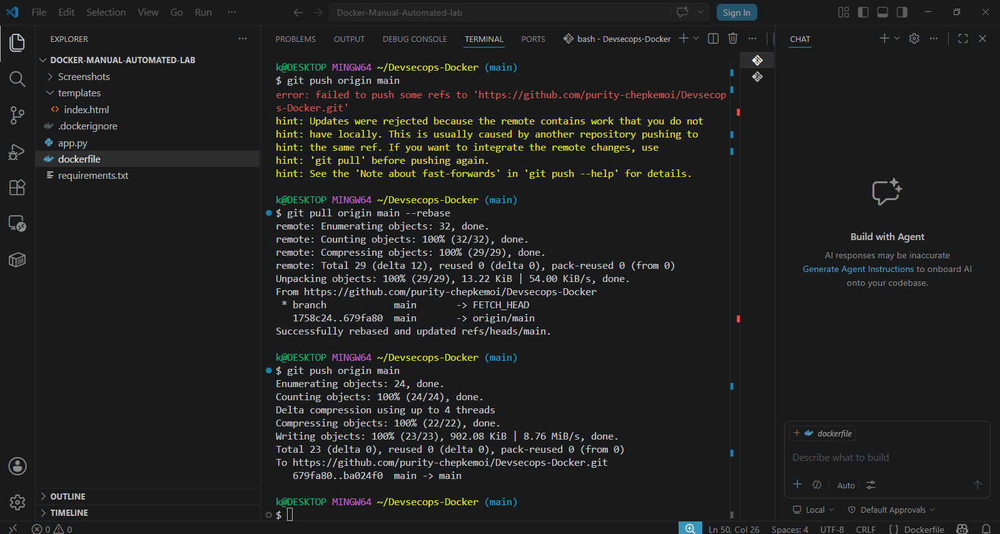

### 2. Add Secrets to GitHub
To allow GitHub Actions to securely push to Docker Hub, `DOCKER_USERNAME` and `DOCKER_PASSWORD` (the access token) were stored as **GitHub Actions Secrets**.

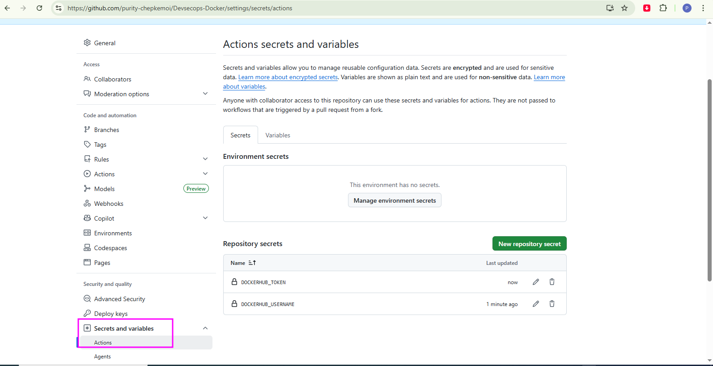

### 3. The Workflow File
A `.github/workflows/main.yml` file was configured to trigger an automated pipeline on every push to the `main` branch. This pipeline automates the build process and incorporates a security scan.

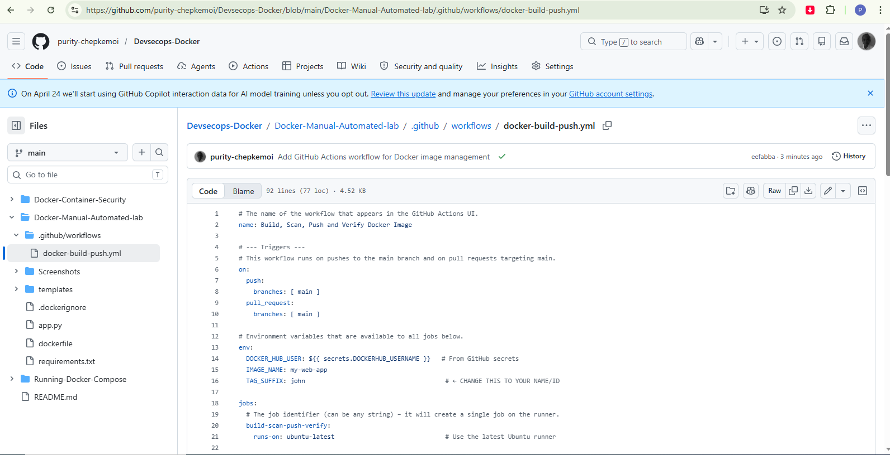

### 4. Errors Encountered & Resolution

#### **Git Push Rejection (Conflict)**
When attempting to push the local changes, the process was rejected with the following error:

```bash
! [rejected] main -> main (fetch first)
error: failed to push some refs to 'https://github.com/purity-chepkemoi/Devsecops-Docker.git'
hint: Updates were rejected because the remote contains work that you do not have locally.
```

* **Reason:** The remote repository contained files (like a README or LICENSE) that were not present in the local copy.
* **Resolution:** Synchronized the history using a rebase before pushing again:

```bash
git pull origin main --rebase
git push origin main
```

#### **Pipeline Failures (Intentional Security Gates)**
The initial workflow runs failed. This was the intended behavior of a DevSecOps gate, as the pipeline is configured to fail if security standards are not met.
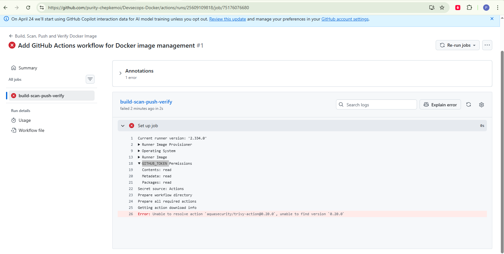
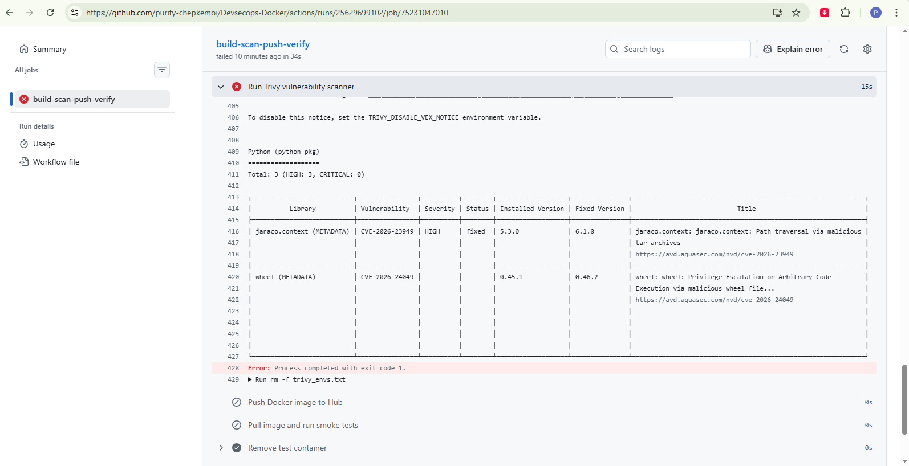
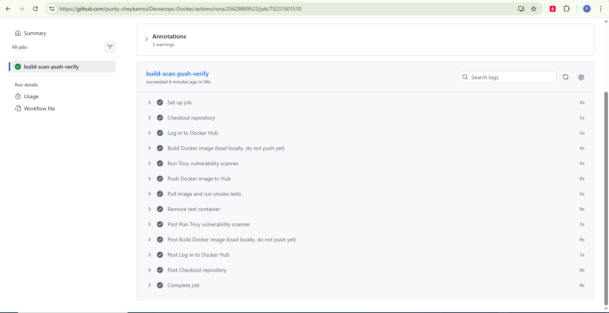

* **Cause 1:** The Trivy security scanner version was outdated (v20).
* **Cause 2:** The base image and dependencies contained HIGH/CRITICAL vulnerabilities.

#### **The Fixes**
To pass the security gate and complete the automation, the following updates were made:
1.  **Workflow Update:** Updated the YAML file to use Trivy version 36.
2.  **Base Image Update:** Switched to a secure, slim base image: `python:3.13-slim`.
3.  **Dependency Update:** Updated `requirements.txt` to use the latest version of Flask: `flask==3.1.1`.

### 5. Pull the Automatically Built Image
Final verification confirmed that the secure, scanned image was successfully built and pushed to Docker Hub by the pipeline.
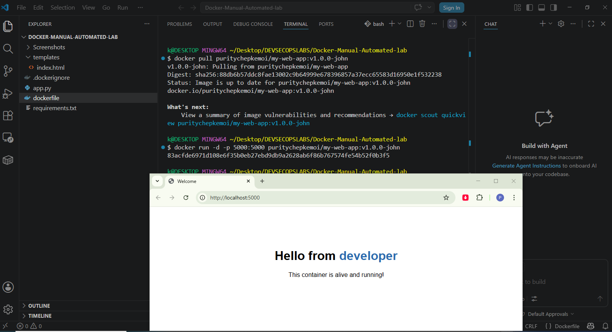

### Clean Up
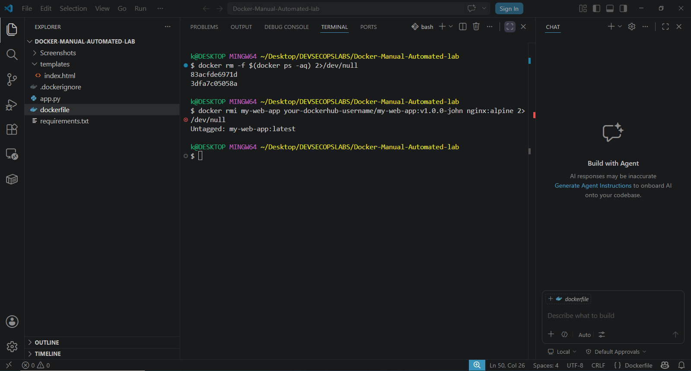
