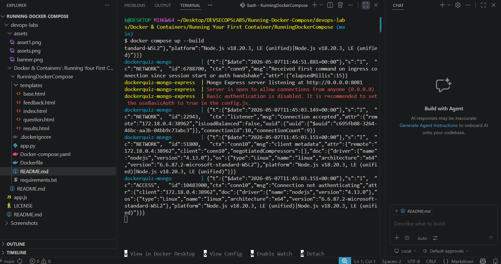
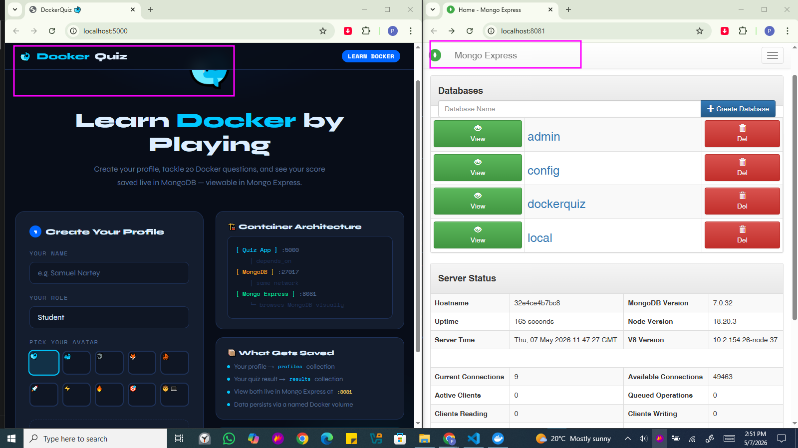
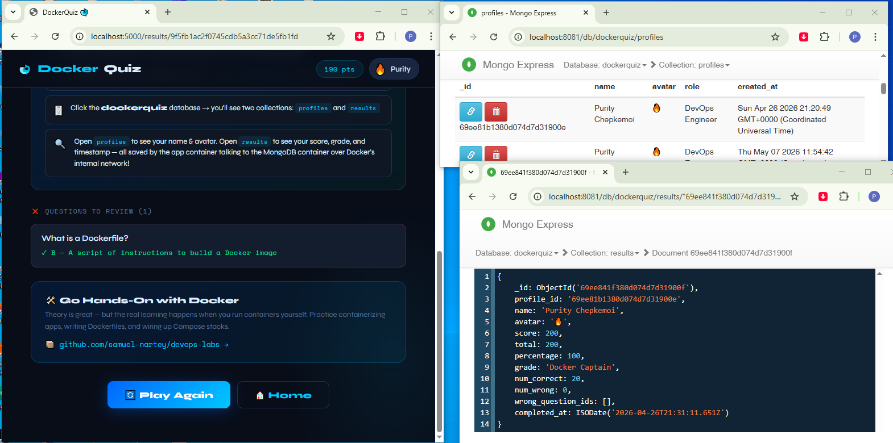
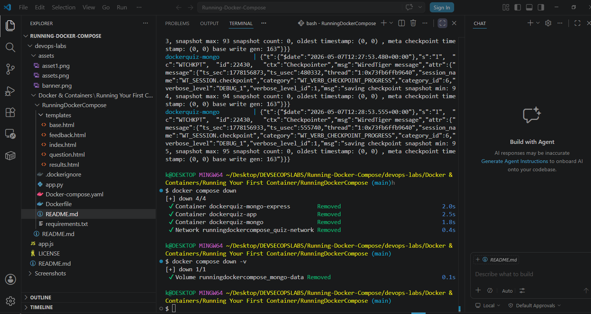

# Practical Lab: Running Your First Container Stack with Docker Compose

This documentation outlines the practical steps taken to deploy, interact with, and tear down a multi-container application using Docker Compose. The lab demonstrates how to orchestrate a frontend quiz application, a MongoDB database, and a database management UI.

## 1. Project Overview
The stack consists of three primary services:
* **Quiz App**: A Python-based web application (running on port 5000).
* **MongoDB**: The NoSQL database used to store user profiles and quiz results.
* **Mongo Express**: A web-based administrative interface for MongoDB (running on port 8081).

## 2. Launching the Stack
To start the application, we use the `docker compose up --build` command. This builds the images from the local Dockerfile and starts all containers defined in the `docker-compose.yaml`.

## 3. Accessing the Applications
Once the containers are healthy, we can access the web interfaces via the local host.

* **Docker Quiz App**: Accessible at `http://localhost:5000`. Here, users can create a profile and take the quiz.
* **Mongo Express**: Accessible at `http://localhost:8081`. This allows us to verify that the `dockerquiz` database and its collections are created correctly.

## 4. Playing the Quiz
As we answer questions in the Quiz App, the data is sent to the MongoDB container over the internal Docker network.

## 5. Verifying Data Persistence
After completing the quiz, we can check the Mongo Express dashboard to confirm that the results were saved. We can see the documents inside the `profiles` and `results` collections, showing the scores and timestamps recorded live.

## 6. Stopping the Services
To stop the containers and clean up the environment, we use `docker compose down`. To ensure all data (including the named volumes) is removed for a fresh start, the `-v` flag is applied.

## Key Security & Docker Principles Observed
* **Container Inter-connectivity**: The Quiz App communicates with MongoDB using service names over a dedicated Docker network [cite: 386, 390].
* **Layer Caching**: Building images uses Docker's build cache to optimize time, with subsequent builds being significantly faster when layers haven't changed [cite: 442, 479, 480].
* **Non-Root Execution**: Running containers as a non-root user (e.g., UID 999) reduces the attack surface and prevents unauthorized system modifications [cite: 512, 545, 601].
* **Volume Management**: Named volumes ensure data persists through container lifecycles until explicitly removed [cite: 386].
